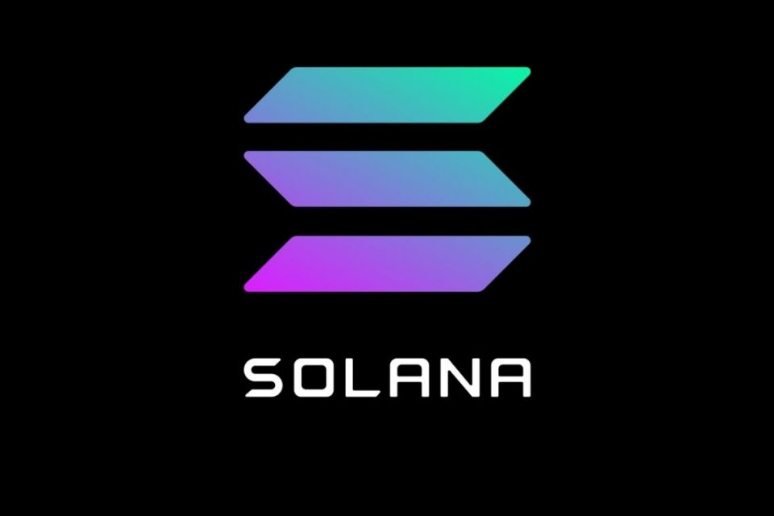

# Solana Foundation Bootcamp

[**Solana Bootcamp - YouTube**](https://www.youtube.com/playlist?list=PLilwLeBwGuK6NsYMPP_BlVkeQgff0NwvU)

Want to understand Solana? This bootcamp breaks down Solana for developers that want to understand architecture, concepts, and build smart contracts.

1. [Introduction to Solana](https://github.com/Laugharne/solana_bootcamp/blob/main/Solana%20Bootcamp%20-%20Episode%201%20-%20Introduction%20to%20Solana.md)
2. [Build Your First Program](https://github.com/Laugharne/solana_bootcamp/blob/main/Solana%20Bootcamp%20-%20Episode%202%20-%20Build%20Your%20First%20Program.md)
3. [Introduction to Staking and Defi](https://github.com/Laugharne/solana_bootcamp/blob/main/Solana%20Bootcamp%20-%20Episode%203%20-%20Introduction%20to%20Staking%20and%20Defi.md)
4. [Defi Expanded](https://github.com/Laugharne/solana_bootcamp/blob/main/Solana%20Bootcamp%20-%20Episode%204%20-%20Defi%20Expanded.md)
5. [Arbitrage and Advanced Programs](https://github.com/Laugharne/solana_bootcamp/blob/main/Solana%20Bootcamp%20-%20Episode%205%20-%20Arbitrage%20and%20Advanced%20Programs.md)
6. [Oracles, Clockwork, and Randomness](https://github.com/Laugharne/solana_bootcamp/blob/main/Solana%20Bootcamp%20-%20Episode%206%20-%20Oracles%2C%20Clockwork%2C%20and%20Randomness.md)
7. [Solana Pay](https://github.com/Laugharne/solana_bootcamp/blob/main/Solana%20Bootcamp%20-%20Episode%207%20-%20Solana%20Pay.md)

